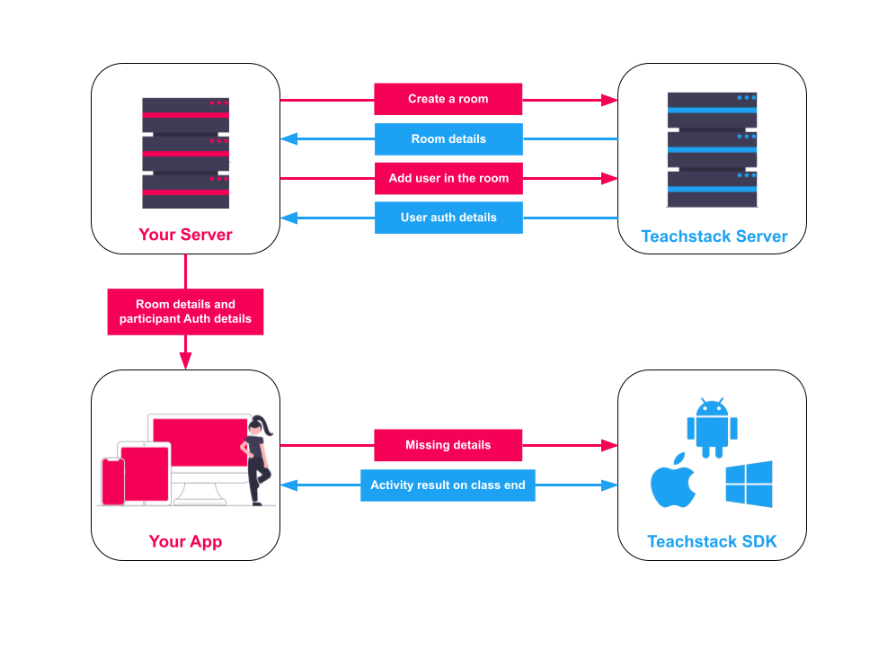

# Introduction

Teachmint’s signature **Educational Video As A Service** product empowers live classroom learning by adding real-time audio/visual communications to your app or website, making your classroom learning into a seamless experience

This site describe how to handle room and user management APIs. You can start using by making api calls to **https://api.teachmint.com**

You will need `client_id` and `auth_key` for making any api calls. If you are interested in using these api please write us at **contact@teachmint.com**

## How Teachstack works?

## More

- The reference for the APIs can be found [**here**](/api)

- The reference for the Android SDK can be found [**here**](/android_sdk)
